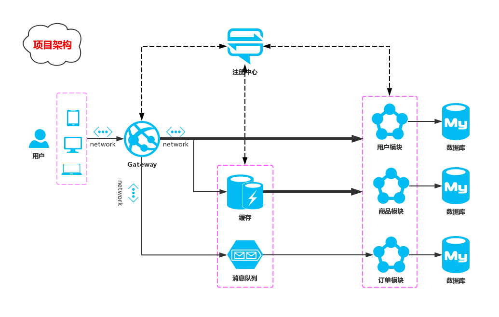

# 分布式高并发商品秒杀系统设计

- [介绍](#介绍)
- [快速启动](#快速启动)
- [系统架构](#系统架构)
- [模块介绍](#模块介绍)
- [Q&A](#Q&A)
- [TODO LIST](#TODO)
- [参考](#参考)

## 介绍

本项目为另一个项目[seckill](https://github.com/Grootzz/seckill)的分布式改进版本，dis-seckill意为：distributed seckill，即分布式秒杀系统。

商品秒杀与其他业务最大的区别在于：

- 低廉价格；
- 大幅推广；
- 瞬时售空；
- 一般是定时上架；
- 时间短、瞬时并发量高、网络的流量也会瞬间变大。

除了具有以上特点，秒杀商品还需要完成正常的电子商务逻辑，即：（1）查询商品；（2）创建订单；（3）扣减库存；（4）更新订单；（5）付款；（6）卖家发货。

本项目正是基于上述业务特点进行设计的，在项目中引入诸多优化手段，使系统可以从容应对秒杀场景下的业务处理。

另外，项目[seckill](https://github.com/Grootzz/seckill)为单体应用，在大并发情形下处理能力有限，所以本项目对其进行分布式改造，对职责进行划分，降低单体应用的业务耦合性。

## 快速启动

- 构建工具

  apache-maven-3.6.1

- 开发环境

  JDK 1.8、Mysql 8.0.12、SpringBoot 2.1.5、zookeeper 3.4.10、dubbo 2.7.1、redis 5.0.5、rabbitmq 3.7.15

在安装之前，需要安装好上述构建工具和开发环境，推荐在linux下安装上述开发环境。

**第一步**；完成数据库的初始化，使用`./dis-seckill-common/schema/seckill.sql`初始化数据库。

**第二步**；如果安装了git，则可以采用下面的方式快速启动；

```properties
git clone git@github.com:Grootzz/dis-seckill.git
mvn clean package
```
启动缓存服务：

```properties
java -jar dis-seckill-cache/target/dis-seckill-cache-0.0.1-SNAPSHOT.jar
```

启动用户服务：

```properties
java -jar dis-seckill-user/target/dis-seckill-user-0.0.1-SNAPSHOT.jar
```

启动订单服务：

```properties
java -jar dis-seckill-order/target/dis-seckill-order-0.0.1-SNAPSHOT.jar
```

启动商品服务：

```properties
java -jar dis-seckill-goods/target/dis-seckill-goods-0.0.1-SNAPSHOT.jar
```

启动消息队列服务：

```properties
java -jar dis-seckill-mq/target/dis-seckill-mq-0.0.1-SNAPSHOT.jar
```

启动网关服务：

```properties
java -jar dis-seckill-gateway/target/dis-seckill-gateway-0.0.1-SNAPSHOT.jar
```

> 注：启动服务时最好按上面的顺序启动。

如果将项目导入IDE中进行构建，则分别按上面的顺序启动服务即可。

**第三步**；访问项目入口地址

<http://localhost:8082/user/index>

初始用户手机号码：18342390420，密码：000000

## 系统架构



- 注册中心使用zookeeper；
- 缓存采用redis；
- 消息队列采用RabbitMQ；
- 用户请求全部交由Gateway模块处理；
- Gateway模块使用RPC的方式调用其他模块提供的服务完成业务处理。

## 模块介绍

- dis-seckill-common：通用模块
- dis-seckill-user：用户模块
- dis-seckill-goods：商品模块
- dis-seckill-order：订单模块
- dis-seckill-gateway：网关模块
- dis-seckill-cache：缓存模块
- dis-seckill-mq：消息队列模块

## Q&A

- [前后端交互接口定义](https://github.com/Grootzz/dis-seckill/blob/master/doc/前后端交互接口定义.md)
- [前后端交互接口逻辑实现](https://github.com/Grootzz/dis-seckill/blob/master/doc/前后端交互接口逻辑实现.md)
- [Redis中存储的数据](https://github.com/Grootzz/dis-seckill/blob/master/doc/Redis中存储的数据.md)
- [使用分布式锁解决恶意用户重复注册问题](https://github.com/Grootzz/dis-seckill/blob/master/doc/使用分布式锁解决恶意用户重复注册问题.md)
- ......

## TODO

- [ ] 引入JWT简化权限验证；
- [x] 完成用户注册功能；
- [ ] 引入分布式锁保证更改密码接口用户注册接口的幂等性，防止用户恶意访问；
- [ ] 服务模块横向扩展；
- [ ] 服务调用的负载均衡与服务降级；
- [ ] gateway模块横向扩展，降低单个应用的压力；
- [ ] Nginx水平扩展;
- [ ] 接口压测；
- [ ] ......

## 参考

- <https://blog.csdn.net/gxftry1st/article/details/78560816>

- <http://coding.imooc.com/class/168.html>
- <https://github.com/Grootzz/seckill>